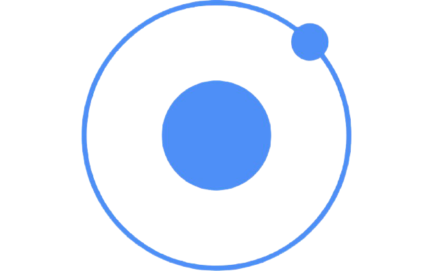

<h2 align="center">👋 Hello! I'm Kashish Solanki.</h2>
<!-- 

  <a href="https://blog.athulcyriac.in">Blog</a> •
  <a href="https://twitter.com/athulcajay">Twitter</a>

 -->

-------

## 🚀 About Me

- 🔭 I’m currently working at **[Digital Trons](https://www.digitaltrons.com/)**
- 🌱 I’m currently exploring new things in technology 😅
- 💬 Ask me about **JavaScript/TypeScript, AWS, Graphql**
- 📫 How to reach me: [kashishsolanki](https://www.linkedin.com/in/kashishsolanki/) on LinkedIn
- ✨ Fun fact: Big Fan of the MarvelStudios

-------

## 🛠 Technology Stack

<table>
  <tr height="100">
    <td align="center" width="80">
        
      </a>
    </td>
    <td align="center" width="80">
        
      </a>
    </td>
    <td align="center" width="80">
        
      </a>
    </td>
    <td align="center" width="80">
        
      </a>
    </td>
    <td align="center" width="100">
        
      </a>
    </td>
    <td align="center" width="80">
        
      </a>
    </td>
    <td align="center" width="80">
        
      </a>
    </td>
    <td align="center" width="80">
        
      </a>
    </td>
    <td align="center" width="150">
        
      </a>
    </td>
  </tr>
</table>
 
